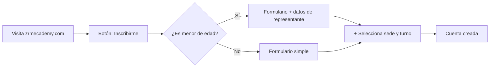
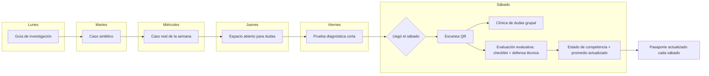
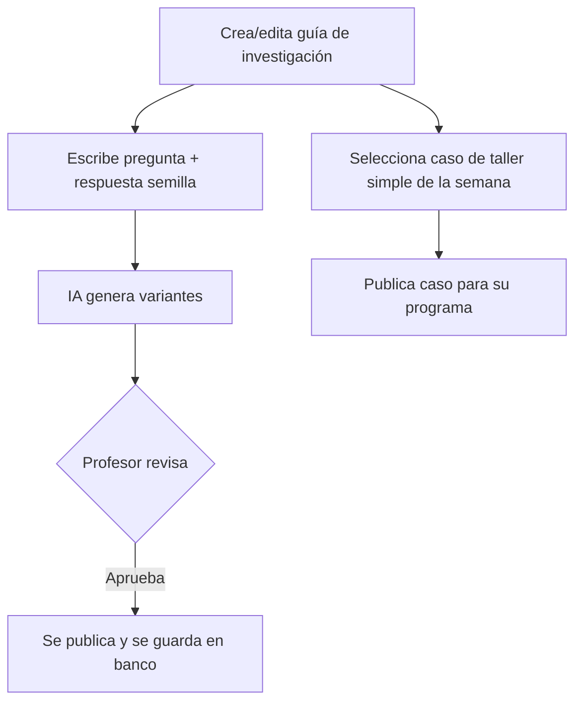

# ZR App · Mapa de Flujos Consolidado (v2) — Versión Revisada y Organizada

> **Fecha:** 13 de agosto de 2026
> **Este documento integra** Fase 1 (ZR_APP) con Fase 2 (metodología MDV).
> **Sigue siendo funcional/lógico, no técnico.** El siguiente está estructurado para revisión humana paso a paso.

---

## ⚠ RESUELTO EN ESTA RONDA (3 items críticos)

| Item | Qué significa | Referencia |
|---|---|---|
| **Modelo híbrido de calificación** | Un solo cálculo alimenta tanto el estado de competencia (dominada/en_desarrollo/requiere_refuerzo) como el promedio institucional (1-20). Dos "lecturas" del mismo número. | Sección 0.1 |
| **Código de carnet en 2 dígitos** | El segmento de "apertura" son 2 dígitos globales por año de sede, **no** distingue mañana/tarde. El turno vive en el perfil del estudiante. | Sección 5.1 |
| **"El otro QR" cerrado** | Son dos QR separados: uno de asistencia y otro de refrigerio. Misma lógica técnica, usos distintos. No fusionarlos. | Sección 5.5 |

---

## 0. Qué cambió respecto a la v1

| Cambio | v1 (Fase 1 sola) | v2 (Fase 1 + Fase 2) |
|---|---|---|
| Registro | cédula, nombre, contacto | + sede y turno (mañana/tarde) |
| Evaluación sábado | examen digital (objetivas + redacción) | **Diagnóstico del viernes** (sin peso en nota) + evaluación evaluativa (checklist + defensa) el sábado |
| Nota | promedio numérico + umbral | **Híbrido**: un solo cálculo = estado de competencia + promedio |
| Alerta de riesgo | proyección de nota | **Competencias en rojo/amarillo acumuladas** + promedio bajo umbral (mismo cálculo) |
| Caso de taller | ninguno | **Un caso simple por semana** (progresión sintético → real) |
| Espacio dudas | none | **Dudas de la semana + clínica Saturday** (una vez por módulo al cerrar, no cada sábado) |

---

## 0.1 El modelo híbrido de calificación — RESUELTO

**Un solo cálculo, dos lecturas:**

1. **Lectura pedagógica (estudiante, en su pasaporte):** El puntaje crudo se traduce a estado — `dominada` / `en_desarrollo` / `requiere_refuerzo`. Usa umbrales fijos en `system_config`. **Si un ítem crítico del checklist falla, el estado nunca puede ser "dominada", sin importar el puntaje.**

2. **Lectura institucional (dirección académica, en reportes):** El mismo puntaje crudo se promedia entre competencias para dar un número de 1 a 20. Útil para constancias, comparaciones y estadísticas. **No determina si el estudiante domina algo — es solo la traducción administrativa del mismo dato.**

**Ventaja:** Nunca hay contradicción entre "dominas esto" y "tu promedio dice otra cosa", porque es el mismo número visto con reglas distintas. No hay que mantener dos sistemas paralelos.

---

## 1. Mapa de Actores

| Rol | Qué hace en el flujo |
|---|---|
| **Estudiante / Representante** | Se registra, selecciona sede/turno, recibe contenido semanal, escanea QR Saturday, ve su pasaporte de competencias, da feedback al fin de módulo |
| **Profesor** | Crea guía + casos de taller, publica contenido semanal, responde dudas, evalúa práctica con checklist, aplica defensa técnica, sube nota al pasaporte |
| **Admin / Directiva** | Valida consentimientos, asigna programas con sede/turno, ve reportes por sede/turno/competencia, gestiona catálogo de casos |
| **Super Admin** | Crea cuentas de profesor y admin, configura `system_config`, dos cuentas definidas desde el inicio |

---

## 2. Flujo Completo — Estudiante

### 2.1 Descubrimiento y Registro



| Paso | Qué pasa | Por qué |
|---|---|---|
| Visita la web, botón "Inscribirme" | Igual que v1 | 🟢 Sin cambios |
| Rama por edad | Igual que v1 | 🟢 Sin cambios |
| **Selecciona sede y turno** | Selector de sede activa + selector mañana/tarde | 🆕 Fase 2. Van al perfil del estudiante directamente. Si cambia de sede/turno después, no afecta su historial de competencias. |

### 2.2 Instalación de la PWA

Igual que v1: pantalla dedicada por SO, confirmación explícita antes de avanzar.

### 2.3 Primer Ingreso / Onboarding

Igual que v1 hasta la aprobación de consentimiento. **Diferencia:** al llegar al carnet digital, este ahora muestra **sede y turno como metadato visible**, útil para verificar rápido en la entrada del sábado que el estudiante está en el turno correcto.

### 2.4 El Ciclo Semanal — ACTUALIZADO



#### Detalle día a día:

| Día | Qué recibe el estudiante | De dónde sale | Por qué es viable |
|---|---|---|---|
| **Lunes** | Guía de investigación | Ya existía (`pre_practice_description`) | Es texto plano, no requiere tecnología nueva |
| **Martes** | Caso sintético | Banco de casos generado por IA (sección 5.3), marcado como "de práctica" con respuesta de referencia conocida | Es autocorrectivo: el estudiante compara su razonamiento contra la respuesta que viene con el caso. **No necesita un tutor que "entienda" lo que escribió.** |
| **Miércoles** | Caso real de la semana | El mismo caso que se trabajará el sábado en el taller | Solo se adelanta dos días al calendario. Es el mismo dato que ya se mostraba el sábado. |
| **Jueves** | Espacio abierto para dudas | Mecanismo ya definido como "duda no bloqueante" | Mismo flujo, ahora con un día visual dedicado. **No bloquea** — si el estudiante entra y ve los 4 contenidos, puede consumirlos libremente. |
| **Viernes** | **Prueba diagnóstica corta** | Examen digital breve de objetivas, **SIN PESO EN LA NOTA** | Mide qué tan preparado llega el grupo. Le da al profesor una foto del estado del grupo **antes** de la clínica Saturday. El resultado no afecta la nota del módulo. |
| **Sábado** | Escana QR | Igual que v1 | 🟢 |
| **Sábado** | **Clínica de dudas grupal** | Profesor resume el contenido de la semana y responde las dudas más repetidas de su programa | ⚠️ **Orden pendiente:** Falta definir si va antes o después de la evaluación evaluativa. Queda marcado en el diagrama como punto de decisión del profesor. |
| **Sábado** | **Evaluación evaluativa (checklist + defensa técnica)** | Lista de cotejo digital durante la práctica + 2-3 preguntas orales sorteadas, nivel 1-4 | ✅ **Resuelto esta ronda.** Este es el cálculo único que alimenta tanto el estado de competencia del pasaporte como el promedio institucional. Basado en lo que el estudiante vivió esa semana. |
| **Sábado** | ✅ **Estado de competencia + promedio** | Un solo cálculo, dos lecturas — ver sección 0.1 | ✅ Resuelto. El pasaporte muestra verde/amarillo/rojo por competencia de forma acumulativa. |
| **Fin de módulo (no cada sábado)** | **Feedback del estudiante** | El estudiante evalúa al profesor/módulo completo **una sola vez** al cerrar el módulo | 🟡 Corrección importante: en v1 ocurría cada sábado (ruido). Ahora es un solo momento por módulo — más significativo porque cubre todo el módulo en vez de una clase suelta. |

### 2.5 Pasaporte de Competencias (mostrado cada sábado)

- Vista acumulativa: cada competencia marcada como `dominada` (verde), `en_desarrollo` (amarillo) o `requiere_refuerzo` (rojo)
- También muestra el promedio del módulo (1-20) según la lectura institucional
- **Nunca muestra comparación con otros estudiantes** — es personal
- El turno y sede del estudiante son visibles en el pasaporte para identificación rápida

---

## 3. Flujo Completo — Profesor

### 3.1 Alta de Cuenta

Igual que v1: la crea el Super Admin, asignada a programa(s). **Ahora la asignación también incluye sede y turno de ese programa.**

### 3.2 Preparación Pre-Sábado



| Paso | Qué pasa | Por qué |
|---|---|---|
| Guía + banco de preguntas asistido por IA | Igual que v1 | 🟢 Sin cambios |
| **Selecciona caso de taller simple** | De un catálogo generado con IA y revisado por criterio técnico (sección 5.3), elige el caso de esa semana | ✅ **Resuelto esta ronda.** El patrón es: profesor da un caso semilla, IA genera variantes, alguien con criterio técnico automotriz lo revisa antes de publicar. Mismo patrón de seguridad que las preguntas del examen. |

### 3.3 Día Sábado — ACTUALIZADO

| Paso | Qué pasa | Por qué | Conexión |
|---|---|---|---|
| **Escana QR de cada estudiante** | Igual que v1, ahora el carnet muestra sede/turno | 🟢🆕 | Con estudiante 2.4 |
| Diagnóstico rápido (opcional) | Examen digital de v1, **ahora sin peso en la nota** | 🆕 | El diagnóstico Friday ya no cuenta para la nota — es solo una foto del preparación del grupo |
| **Clínica de dudas** | Ve todas las dudas de su programa de esa semana agrupadas por tema/frecuencia | 🆕 | Con estudiante 2.4. El orden (antes o después de evaluación) lo define el profesor. |
| **Evalúa práctica con checklist** | Marca cada ítem de la lista de cotejo; si un ítem crítico falla, el sistema deriva `requiere_refuerzo` automáticamente | 🆕 | Con estudiante 2.4. El "único cálculo" de la sección 0.1 toma este resultado. |
| **Aplica defensa técnica** | Sortea preguntas, registra nivel 1-4 alcanzado | 🆕 | Con estudiante 2.4. Mismo cálculo único. |

### 3.4 Post-Sábado

| Paso | Qué pasa | Por qué |
|---|---|---|
| **Pasaporte de la programa** | Ve el estado de todas las competencias de sus estudiantes | ✅ **Resuelto.** Reemplaza la "cola de calificación" de redacciones. El examen digital ya no tiene SLA de 72h porque no determina la nota. |
| Reportes de programa | Incluye "estudiantes con competencias en rojo/amarillo acumuladas" | ⚠️ Depende del modelo híbrido confirmado (sección 0.1). |

---

## 4. Flujo Completo — Admin / Directiva

| Paso | Qué pasa | Por qué |
|---|---|---|
| **Gestión de usuarios** | Igual que v1, ahora con filtro por sede y turno | 🟢🆕 |
| **Gestión de consentimientos** | Sin cambios | 🟢 |
| **`system_config`** | Sin cambios, dos super_admin ya definido | 🟢 |
| **Reportes agregados** | Ahora se pueden cruzar por sede, turno, y estado de competencia | 🆕 **Nueva dimensión antes inexistente.** Antes solo existía programa. |
| **Catálogo de casos de taller** | ✅ **Resuelto:** Se genera con IA a partir de un caso semilla y se revisa antes de publicar — ver sección 5.3 | |

---

## 5. Código del Carnet, Nombre del Programa, Catálogo de Casos y Control de Módulos

### 5.1 Código de Carnet — Formato Propuesto

Tu descripción original: `XXXX-XXXX(año)-XX(turno, apertura 01,02...)-XXX(últimos dígitos cédula)`

**Formato confirmado esta ronda — se mantiene en 2 dígitos** (como pediste). El segmento de apertura es un número global por año de sede, **sin importar si es mañana o tarde**:

```
SEDE(4) - AÑO(4) - APERTURA(2) - CÉDULA(3)
Ejemplo:  CCST   -  2026  -   01    -  456
```

| Segmento | De dónde sale | Automático |
|---|---|---|
| `SEDE` (4 caracteres) | Código fijo de 4 letras que dirección académica define una sola vez al crear cada sede (ej. `CCST` para una sede en Caracas) | Sí, se toma del perfil de la sede |
| `AÑO` (4 dígitos) | Año en que se crea el registro | Sí, lo pone el sistema con la fecha actual |
| `APERTURA` (2 dígitos) | Número secuencial global de apertura ese año — `01` es la primera apertura ese año en esa sede, `02` la segunda, así sea mañana o tarde | Sí, el sistema cuenta cuántas aperturas ya existen y asigna la siguiente |
| `CÉDULA` (3 dígitos) | Últimos 3 dígitos de la cédula del estudiante | Sí, se toma del perfil |

**Este código se genera UNA SOLA VEZ** al aprobarse el registro del estudiante (después del consentimiento si es menor), y queda visible en su carnet y en la base general. **El turno del estudiante ya está guardado como campo propio en su perfil** (sección 2.1) — no hace falta que también viva dentro del código para poder filtrar por turno en los reportes.

### 5.2 Nombre del Programa — Formato Propuesto

`AÑO-NN` (ej. `2026-01`), donde `NN` es el número secuencial de apertura de programas de ese año. **Mismo mecanismo de conteo** que la apertura del carnet, pero a nivel de programa completo, no por turno individual. Se autoasigna al crear el programa, dirección académica no tiene que llevar la cuenta a mano.

### 5.3 Catálogo de Casos de Taller — Generado con IA

Igual que el banco de preguntas: profesor (o dirección académica) da un caso semilla simple, la IA genera variantes del mismo nivel de dificultad para otras semanas/módulos, y **se guardan en un banco reutilizable** tras revisión humana.

**Patrón de seguridad mismo que las preguntas:** **Ningún caso se publica sin que alguien con criterio técnico automotriz lo revise primero.** Por el riesgo de un dato técnico incorrecto llegando a un estudiante.

### 5.4 Control de Módulos — Quién Decide Cuándo Empiezan y Terminan

**No es una decisión manual cada semana, sino un calendario definido UNA SOLA VEZ** al crear el programa:

1. Dirección académica, al crear un programa (ej. `2026-01`), define la fecha de inicio y la duración estándar en semanas de cada uno de los módulos (probablemente la misma duración para todos, solo cambia la fecha de arranque).
2. El sistema calcula automáticamente en qué módulo y semana está cada programa, comparando la fecha de hoy contra ese calendario. **Nadie tiene que "cerrar" un módulo a mano cada vez.**
3. Si hay que pausar por feriado o imprevisto, dirección académica inserta una pausa puntual y el calendario completo del programa se corre hacia adelante automáticamente, sin recalcular nada manualmente.

**Así, la autoridad que decide es dirección académica (una vez, al crear el programa), pero el día a día de "en qué módulo estamos" lo resuelve el sistema solo.**

### 5.5 "El otro QR" — RESUELTO

**Son dos QR con la misma lógica técnica, pero usos distintos:**

- **QR de asistencia:** Para pasar lista. El profesor lo valida en la pantalla de escaneo.
- **QR de refrigerio:** Para marcar entrega de refrigerio. Mismo mecanismo de carnet rotativo, pero evento independiente.

**Qué necesita el flujo para diferenciarlos:**

| Elemento | QR de Asistencia | QR de Refrigerio |
|---|---|---|
| **En el carnet del estudiante** | Pestaña/o botón por defecto (asistencia) | Botón alternativo "Refrigerio" |
| **En la pantalla de escaneo del profesor** | Selecciona "Asistencia" al comenzar | Selecciona "Refrigerio" cuando corresponde |
| **Lógica de validación** | Inserta en `attendance_events` con `method = 'qr'` | Inserta/actualiza `snack_claimed_at` en `attendance_events` |
| **Por qué no fusionarlos** | Si alguien llega pero no hay refrigerio, es un evento independiente que no debería afectar su asistencia | Si fusionamos, perderíamos la independencia entre "estaba presente" y "recibió porción" |

**Conclusión:** Misma base técnica (carnet rotativo TOTP), dos razones de uso distintas. **No conviene fusionarlos en un solo QR con doble uso** porque perderíamos el control independiente de cada hecho.

### 5.6 Ideas para Fases Futuras — Anotadas, No Se Implementan Ahora

| Idea | Qué sería | Estado |
|---|---|---|
| **Curso breve, aparte de "programa" completo** | Vía de inscripción distinta para un curso corto (no los 13 módulos completos) | 🟡 Anotado para evaluar en fase futura. Cuando se retome, probablemente necesite su propio esquema de registro y nombre (no encajaría en `AÑO-NN` de programa completo). |
| **Chat interactivo grupal** | Espacio de conversación dentro de la app para el grupo/programa | 🟡 Anotado para evaluar más adelante. Probablemente se beneficie de la decisión de tutor de IA que ya dejamos fuera de esta fase, para no construir infraestructura de chat dos veces. |

---

## 7. Qué se Mantiene Explicitamente Fuera de Esta Fase

Sin cambios respecto a lo acordado:

- Microlecciones con video
- Tutor de IA
- Auditoría de IA nivel 4
- Carriles abiertos lunes-viernes obligatorios
- Compuerta A automática de viernes 22:00
- Videollamada del jueves
- Pruebas de retención semana 6/12

**Nada de esto se necesita para que el flujo de arriba funcione completo.**

---

## 8. Huecos Pendientes (Mínimos para Continuar)

| Hueco | Estado | Quien lo define |
|---|---|---|
| **Orden: clínica de dudas vs. evaluación evaluativa del sábado** | 🟡 En evaluación tú | Tú defines el orden en la práctica Saturday |
| **¿Un estudiante puede tener varias sedes/turnos activos a la vez?** | 🔴 Sigue abierto | Fase 2 — decisión de arquitectura |
| **¿Las dudas sin resolver en la clínica Saturday se contestan después o esperan a la siguiente semana?** | 🔴 Sigue abierto | Fase 2 — política de seguimiento |

**Resueltos en esta ronda:** modelo híbrido de calificación (0.1), formato final del código de carnet en 2 dígitos (5.1), "el otro QR" es el de refrigerio (5.5), quién carga el catálogo de casos (5.3), y el control de módulos (5.4).

---

## 9. Próximo Paso

> **Ya no queda ningún bloqueante grande.** Los tres pendientes más importantes se resolvieron esta ronda:
> 1. Modelo híbrido de calificación ✅
> 2. Formato del código de carnet ✅
> 3. Doble QR (asistencia + refrigerio) ✅

Solo quedan tres huecos menores, ninguno bloquea empezar a especificar técnicamente.

**Con este documento, el de correcciones y el de alcance de Fase 2, ya está el "qué" y el "por qué" completo de las tres capas de usuario.**

El siguiente documento natural ya no sería de flujo sino de **especificación técnica** (contratos de datos entre pantallas, máquinas de estado) — como se dejó anotado al final de la v1.

---
*Documento generado para revisión humanade flujos de usuario y lógica de negocio en ZR App. Versión: v2_revisado 13/08/2026.*